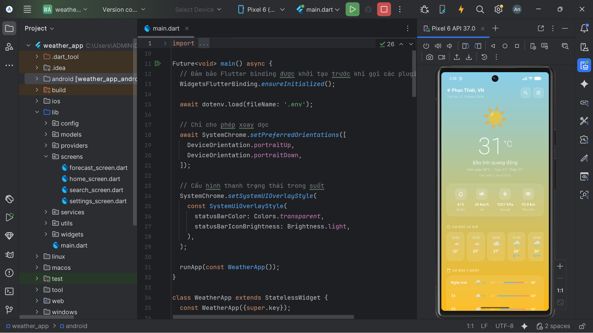
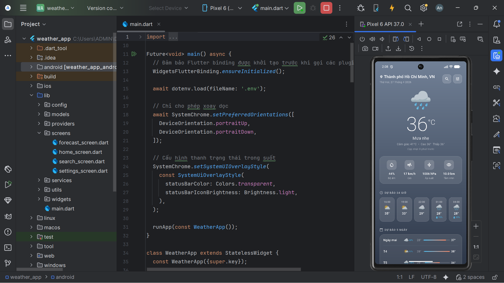
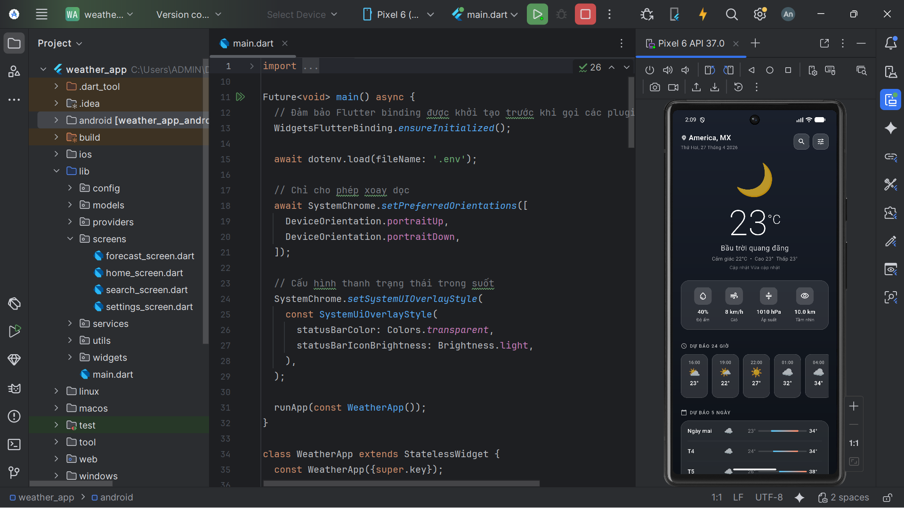
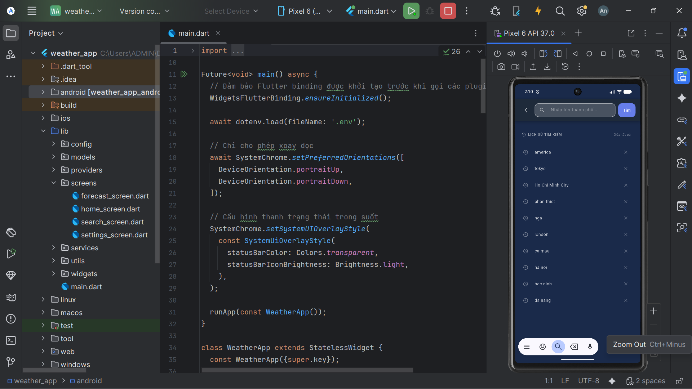
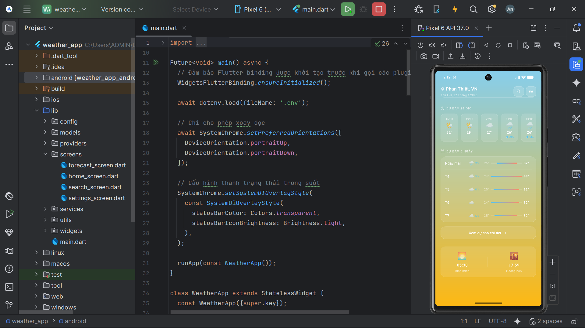
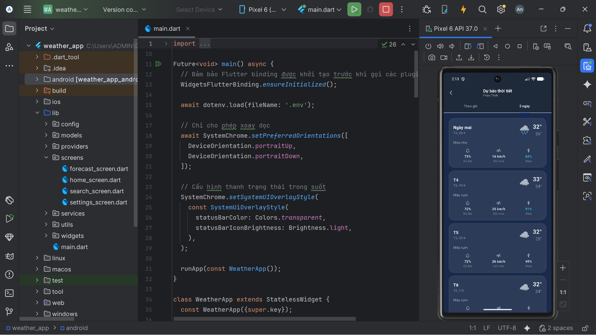
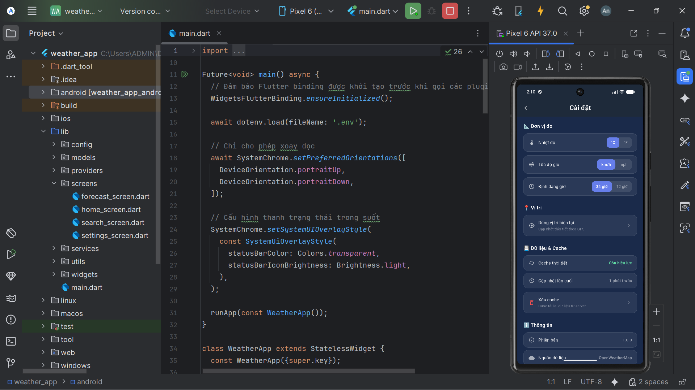
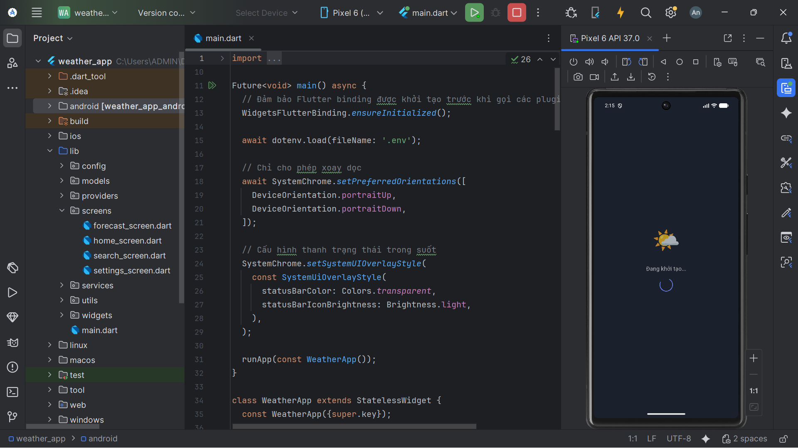

# 🌦️ Weather App 

Ứng dụng dự báo thời tiết toàn diện được xây dựng bằng **Flutter**, tích hợp dữ liệu thời gian thực từ **OpenWeatherMap API**. Dự án này tập trung vào kiến trúc sạch, quản lý trạng thái hiệu quả và trải nghiệm người dùng mượt mà.

Demo: https://drive.google.com/file/d/18UjWFWV8tMbjKjWuKTpBqwc0uoq3gOYq/view?usp=drive_linkhttps://drive.google.com/file/d/18UjWFWV8tMbjKjWuKTpBqwc0uoq3gOYq/view?usp=drive_link

##  Tính năng chính

### Dự báo thời tiết thời gian thực
* **Vị trí hiện tại:** Tự động lấy dữ liệu thời tiết dựa trên GPS của thiết bị.
* **Thông tin chi tiết:** Hiển thị nhiệt độ, cảm giác thực tế (feels like), độ ẩm, tốc độ gió, áp suất và tầm nhìn.
* **Dự báo 24 giờ:** Danh sách dự báo theo từng giờ trong ngày.
* **Dự báo 7 ngày:** Xem trước tình hình thời tiết trong tuần tới với nhiệt độ cao nhất/thấp nhất.

### Tìm kiếm và Cá nhân hóa
* **Tìm kiếm thông minh:** Tìm kiếm thời tiết theo tên thành phố trên toàn thế giới.
* **Yêu thích:** Lưu trữ tối đa 5 thành phố yêu thích để truy cập nhanh.
* **Lịch sử:** Lưu lại các vị trí đã tìm kiếm gần đây.

### Trải nghiệm người dùng (UX)
* **Dynamic UI:** Giao diện thay đổi màu sắc và gradient linh hoạt theo điều kiện thời tiết (Nắng, Mưa, Mây, Đêm).
* **Hỗ trợ ngoại tuyến:** Lưu bộ nhớ đệm (Caching) dữ liệu lần cuối cùng để xem khi không có mạng.
* **Pull-to-refresh:** Vuốt để cập nhật dữ liệu mới nhất.
* **Cài đặt:** Tùy chỉnh đơn vị nhiệt độ (Celsius/Fahrenheit), tốc độ gió và định dạng thời gian.

## Hình ảnh ứng dụng
* Thời tiết nắng
  

* Thời tiết mưa
  

* Chế độ đêm
  

* Tìm kiếm
  

* Dự báo
  

* Chi tiết dự báo
  

* Setting
  

* Đổi chỉ số
  

* splash
  

## Cấu hình API Key:
* Tạo file .env tại thư mục gốc. Thêm dòng sau vào file .env:
* Đoạn mã: OPENWEATHER_API_KEY=YOUR_API_KEY_HERE
* Lưu ý: Có thể lấy key tại OpenWeatherMap.


##  Công nghệ sử dụng

* **State Management:** `Provider`
* **Networking:** `http`, `connectivity_plus`
* **Location:** `geolocator`, `geocoding`
* **Storage:** `shared_preferences` (Caching & Favorites)
* **Utilities:** `intl`, `flutter_dotenv`, `cached_network_image`

## Hướng dẫn cài đặt
* Clone dự án:
  * git clone [https://github.com/VanAn6504/flutter_weather_app_NguyenVanAn.git](https://github.com/VanAn6504/flutter_weather_app_NguyenVanAn.git)
  * cd weather_app
* Cài đặt thư viện:
  * flutter pub get

## Known Limitations
API miễn phí giới hạn 1,000 cuộc gọi/ngày.

Dữ liệu dự báo có thể chậm cập nhật khoảng 10-15 phút so với thực tế.

Chưa hỗ trợ các vùng sâu vùng xa không có dữ liệu trạm khí tượng.

## Future Improvements
Tích hợp bản đồ Radar thời tiết.

Thông báo đẩy (Push Notifications) khi có cảnh báo thiên tai.

Hỗ trợ đa ngôn ngữ (Localization).

Thêm Widget trên màn hình chính của điện thoại.

##  Cấu trúc thư mục

```text
lib/
├── config/     # Cấu hình API, hằng số
├── models/     # Các lớp dữ liệu (Weather, Forecast,...)
├── services/   # Xử lý Logic (API, GPS, Storage)
├── providers/  # Quản lý trạng thái ứng dụng
├── screens/    # Các màn hình chính (Home, Search, Settings)
├── widgets/    # Các thành phần giao diện dùng chung
└── utils/      # Định dạng ngày tháng, màu sắc, icon